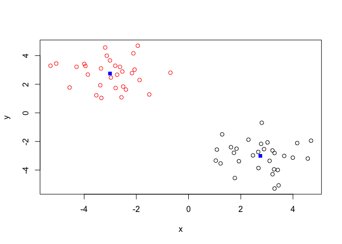
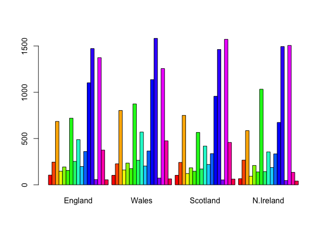

class09
================
Jinyoung Park
2/4/2020

## K-means clustering

This main k-means function in R is called `kmeans()`. Let’s play with it
here.

``` r
# Generate some example data for clustering
tmp <- c(rnorm(30,-3), rnorm(30,3))
x <- cbind(x=tmp, y=rev(tmp))
plot(x)
```

<!-- -->

Use the kmeans() function setting k to 2 and nstart=20

``` r
km <- kmeans(x, centers = 2, nstart = 20)
km
```

    ## K-means clustering with 2 clusters of sizes 30, 30
    ## 
    ## Cluster means:
    ##           x         y
    ## 1  2.749928 -3.009474
    ## 2 -3.009474  2.749928
    ## 
    ## Clustering vector:
    ##  [1] 2 2 2 2 2 2 2 2 2 2 2 2 2 2 2 2 2 2 2 2 2 2 2 2 2 2 2 2 2 2 1 1 1 1 1 1 1 1
    ## [39] 1 1 1 1 1 1 1 1 1 1 1 1 1 1 1 1 1 1 1 1 1 1
    ## 
    ## Within cluster sum of squares by cluster:
    ## [1] 59.65169 59.65169
    ##  (between_SS / total_SS =  89.3 %)
    ## 
    ## Available components:
    ## 
    ## [1] "cluster"      "centers"      "totss"        "withinss"     "tot.withinss"
    ## [6] "betweenss"    "size"         "iter"         "ifault"

Inspect/print the results

Q. How many points are in each cluster? Q. What ‘component’ of your
result object details - cluster size? - cluster assignment/membership? -
cluster center?

``` r
#cluster size
km$size
```

    ## [1] 30 30

``` r
km$cluster
```

    ##  [1] 2 2 2 2 2 2 2 2 2 2 2 2 2 2 2 2 2 2 2 2 2 2 2 2 2 2 2 2 2 2 1 1 1 1 1 1 1 1
    ## [39] 1 1 1 1 1 1 1 1 1 1 1 1 1 1 1 1 1 1 1 1 1 1

``` r
length(km$cluster)
```

    ## [1] 60

``` r
table(km$cluster)
```

    ## 
    ##  1  2 
    ## 30 30

Plot x colored by the kmeans cluster assignment and add cluster centers
as blue points

``` r
plot(x, col=km$cluster)
points(km$centers, col= "blue", pch= 15, cex= 1)
```

<!-- -->

## Hierarchial clustering in R

The main Hierarchical clustering function in R is called `hclust()`. An
important point here is that you have to calculate the distance maxtrix
deom your input data before calling `hclust()`.

``` r
# We will use our x again from above...
d <- dist(x)
hc <- hclust(d)
hc
```

    ## 
    ## Call:
    ## hclust(d = d)
    ## 
    ## Cluster method   : complete 
    ## Distance         : euclidean 
    ## Number of objects: 60

Folks often view the results of Hierarchical clustering graphically.
Lets try passing this to the `plot()` function.

``` r
plot(hc)
abline(h=10, col="red", lty=3)
abline(h=6, col="blue", lty=1)
```

<!-- -->

To get cluster membership vector I need to “cut” the tree at a certain
height to yield my seperate cluster
    branches.

``` r
cutree(hc, h=6)
```

    ##  [1] 1 1 1 1 1 1 1 1 1 1 1 1 1 1 1 1 1 1 1 1 1 1 1 1 1 1 1 1 1 1 2 2 2 2 2 2 2 2
    ## [39] 2 2 2 2 2 2 2 2 2 2 2 2 2 2 2 2 2 2 2 2 2 2

``` r
gp4 <- cutree(hc, k=6)
```

Let’s try with some more real like data…

``` r
# Step 1. Generate some example data for clustering
x <- rbind(
 matrix(rnorm(100, mean=0, sd = 0.3), ncol = 2), # c1
 matrix(rnorm(100, mean = 1, sd = 0.3), ncol = 2), # c2
 matrix(c(rnorm(50, mean = 1, sd = 0.3), # c3
 rnorm(50, mean = 0, sd = 0.3)), ncol = 2))
colnames(x) <- c("x", "y")
# Step 2. Plot the data without clustering
plot(x)
```

<!-- -->

``` r
# Step 3. Generate colors for known clusters
# (just so we can compare to hclust results)
col <- as.factor( rep(c("c1","c2","c3"), each=50) )
plot(x, col=col)
```

<!-- -->

Q. Use the `dist()`, `hclust()`, `plot()` and `cutree()` functions to
return 2 and 3 clusters

Q. How does this compare to your known ‘col’ groups?

``` r
hc <- hclust(dist(x))
plot(hc)
abline(h=1.7, col="red")
```

<!-- -->

To get cluster membership vector use `cutree()` and then use `table()`
to tabulate up how many members in each cluster we have.

``` r
grps <- cutree(hc, k=3)
grps
```

    ##   [1] 1 1 1 1 2 1 1 1 1 1 1 1 1 1 1 1 1 1 1 1 1 3 1 1 1 1 1 1 1 1 1 1 1 1 1 1 1
    ##  [38] 1 1 1 1 1 1 1 1 1 1 1 1 1 2 2 2 2 2 2 2 2 2 2 2 2 2 2 2 2 2 2 2 2 2 2 2 2
    ##  [75] 2 2 2 2 2 2 2 2 2 2 2 2 2 2 2 2 2 2 2 2 2 2 2 2 2 2 3 2 2 3 3 3 3 3 3 3 2
    ## [112] 3 2 3 3 2 3 2 1 3 3 3 1 2 3 3 3 3 3 2 2 3 1 3 2 1 2 1 3 3 2 3 3 2 3 3 2 2
    ## [149] 2 3

``` r
table(grps)
```

    ## grps
    ##  1  2  3 
    ## 53 67 30

Make a plpot with our cluster results

``` r
plot(x, col=grps)
```

<!-- -->

## PCA of UK food data

``` r
x <- read.csv("UK_foods.csv", row.names=1)
```

Lets make some plots to explore our data a bit more

``` r
barplot(as.matrix(x), beside=T, col=rainbow(nrow(x)))
```

<!-- -->

``` r
barplot(as.matrix(x), beside=F, col=rainbow(nrow(x)))
```

<!-- -->

A “pairs” plot can be helpful when we have small datasets like this one
but often we are dealing with data that is too large for these
apporaches :-(

``` r
pairs(x, col=rainbow(10), pch=16)
```

<!-- -->

Principal Component Analysis (PCA) `prcomp()`

``` r
pca <- prcomp( t(x) )
#pca
```

What is in my result object `pca`? I can check the attributes…

``` r
attributes(pca)
```

    ## $names
    ## [1] "sdev"     "rotation" "center"   "scale"    "x"       
    ## 
    ## $class
    ## [1] "prcomp"

``` r
plot(pca$x[,1], pca$x[,2], xlab="PC1", ylab = "PC2")
text(pca$x[,1], pca$x[,2], colnames(x), col= c("grey","red","blue","darkgreen"))
```

<!-- -->

``` r
summary(pca)
```

    ## Importance of components:
    ##                             PC1      PC2      PC3       PC4
    ## Standard deviation     324.1502 212.7478 73.87622 4.189e-14
    ## Proportion of Variance   0.6744   0.2905  0.03503 0.000e+00
    ## Cumulative Proportion    0.6744   0.9650  1.00000 1.000e+00
